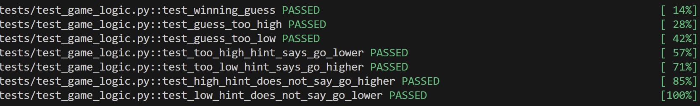

# 🎮 Game Glitch Investigator: The Impossible Guesser

## 🚨 The Situation

You asked an AI to build a simple "Number Guessing Game" using Streamlit.
It wrote the code, ran away, and now the game is unplayable. 

- You can't win.
- The hints lie to you.
- The secret number seems to have commitment issues.

## 🛠️ Setup

1. Install dependencies: `pip install -r requirements.txt`
2. Run the broken app: `python -m streamlit run app.py`

## 🕵️‍♂️ Your Mission

1. **Play the game.** Open the "Developer Debug Info" tab in the app to see the secret number. Try to win.
2. **Find the State Bug.** Why does the secret number change every time you click "Submit"? Ask ChatGPT: *"How do I keep a variable from resetting in Streamlit when I click a button?"*
3. **Fix the Logic.** The hints ("Higher/Lower") are wrong. Fix them.
4. **Refactor & Test.** - Move the logic into `logic_utils.py`.
   - Run `pytest` in your terminal.
   - Keep fixing until all tests pass!

## 📝 Document Your Experience

- [ ] Describe the game's purpose.
The game's purpose is to guess a secret number between a certain range within a limited number of attempts. The game provides hints whether the guess is too high or too low and keeps track of the number of attempts left. The player wins by guessing the secret number correctly within the allowed attempts.
- [ ] Detail which bugs you found.
1. The secret number kept changing every time I clicked the "Submit" button, which made it impossible to win the game.
2. The hints provided by the game were incorrect, telling me to guess higher when I needed to guess lower and vice versa.
3. The "New Game" button did not reset the game after I had won, allowing me to continue guessing without starting a new game.
- [ ] Explain what fixes you applied.
1. I fixed the issue with the secret number changing by using Streamlit's session state to store the secret number, ensuring that it remains consistent across reruns of the app.
2. I corrected the logic for the hints by ensuring that the conditions for providing "Higher" or "Lower" hints were based on the actual comparison between the guess and the secret number.
3. I modified the "New Game" button functionality to reset the game state, including generating a new secret number and resetting the attempts left, regardless of whether the player had won or not.

## 📸 Demo

- []